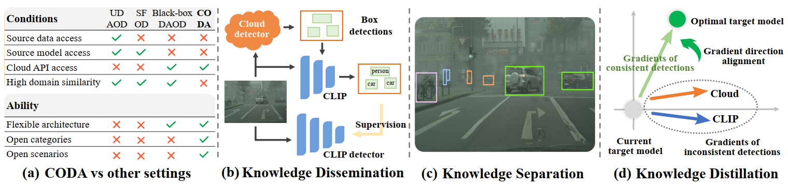

<div align="center">

<h1> Cloud Object Detector Adaptation by Integrating Different Source Knowledge (NeurIPS-24) </h1>


<h5 align="center"> 
<a href='https://openreview.net/pdf?id=S8SEjerTTg'></a>
<a href='https://huggingface.co/Flashkong/COIN/tree/main'></a>

[Shuaifeng Li](https://flashkong.github.io)<sup>1</sup>,
[Mao Ye](https://scholar.google.com/citations?user=UUbEzBYAAAAJ)<sup>1*</sup>,
[Lihua Zhou](https://scholar.google.com/citations?user=7wECe98AAAAJ)<sup>1</sup>,
[Nianxin Li](https://scholar.google.com/citations?user=DMey5ssAAAAJ)<sup>1</sup>,
[Siying Xiao](https://scholar.google.com/citations?user=TosYOUsAAAAJ)<sup>1</sup>,
[Song Tang](https://scholar.google.com/citations?user=8uhkD9QAAAAJ)<sup>2</sup>,
[Xiatian Zhu](https://scholar.google.com/citations?user=ZbA-z1cAAAAJ)<sup>3</sup>


<sup>1</sup>University of Electronic Science and Technology of China

<sup>2</sup>University of Shanghai for Science and Technology, <sup>3</sup>University of Surrey

[`Paper`](https://openreview.net/pdf?id=S8SEjerTTg) | [`Project`](https://flashkong.github.io/projects/coin) | [`Slides`](https://flashkong.github.io/files/COIN/COIN_slides.pdf) | [`Poster`](https://flashkong.github.io/files/COIN/COIN_poster.pdf) | [`Blog`](https://flashkong.github.io/blogs/coin/) | [`RedNote`](http://xhslink.com/a/72l2748aVCr1) | [`知乎`](https://zhuanlan.zhihu.com/p/11666611412)
</h5>
</div>

# 💥 News

Welcome to my homepage: [Shuaifeng Li](https://flashkong.github.io).

We follow the trend of the times and explore an interesting and promising problem, `Cloud Object Detector Adaptation (CODA)`, where the target domain leverages detections provided by a large vision-language cloud detector to build a target detector. **Thank to the large cloud model, open target scenarios and categories are able to be adapted, making open-set adaptation no longer a problem.**

*Please note that CODA aims to adapt/distill the cloud detector to target domain, e.g., a target detector, so the use of CLIP is optional. To address the CODA problem, our method, COIN, employs CLIP; however, **this does not imply that the CODA problem setting assumes the existence of a local (CLIP or source domain) detector, nor does it assume that CLIP must necessarily be used.** Please keep this distinction in mind.*


🎯 Our previous CVPR'22 ORAL work, `Source-Free Object Detection by Learning to Overlook Domain Style`, investigates the problem of source-free domain adaptive object detection, which considers privacy protection issues and assumes that source domain data is unaccessible. If you are interested, welcome to explore our [Paper](https://openaccess.thecvf.com/content/CVPR2022/papers/Li_Source-Free_Object_Detection_by_Learning_To_Overlook_Domain_Style_CVPR_2022_paper.pdf) and [Code](https://github.com/Flashkong/Source-Free-Object-Detection-by-Learning-to-Overlook-Domain-Style).

## 🎉 Real-world applications

Fortunately, during the paper review process, the successive releases of [Grounding DINO 1.5](https://www.deepdataspace.com/blog/5), [1.6](https://www.deepdataspace.com/blog/6), and even [DINO-X](https://www.deepdataspace.com/blog/7) have provided a timely boost to our work. Moreover, IDEA-Research has officially opened access to the [Grounding DINO 1.5 API](https://github.com/IDEA-Research/Grounding-DINO-1.5-API), offering a more practical and robust application scenario for our paper.  

To request an API key for Grounding DINO 1.5, please follow the steps outlined [here](https://github.com/IDEA-Research/Grounding-DINO-1.5-API?tab=readme-ov-file#api-usage) and install the environment following [this guide](docs/Environment.md#install-with-python39).

We have written an example for the Foggy-Cityscapes dataset. Please write the obtained [TOKEN](https://cloud.deepdataspace.com/dashboard/api-quota) into the bash files in the `scripts/GDINO1.5API/` folder after `MODEL.TEACHER_CLOUD.TOKEN`, and then run the following command. Please refer to [here](https://github.com/Flashkong/COIN?tab=readme-ov-file#-get-start) for detailed explanation.
```bash
conda activate coin3.9api
bash scripts/GDINO1.5API/test/GDINO1.5API.sh
bash scripts/GDINO1.5API/test/CLIP.sh
bash scripts/GDINO1.5API/pretrain/CLIPDET.sh
bash scripts/GDINO1.5API/final/targetDET.sh
```

For datasets other than the six used in the paper, please prepare VOC format data and add lines in `coin/data/datasets/builtin.py`

## ⏳ Preparation
First, clone this repository: `git clone https://github.com/Flashkong/COIN.git && cd COIN`.

For environment setup, please refer to [docs/Environment.md](docs/Environment.md). For dataset preparation, please refer to [docs/Datasets.md](docs/Datasets.md).

Then, execute the following command:
```bash
conda activate coin
rm -rf ./datasets  # Please make sure you have completed all steps in 'docs/Datasets.md'
ln -s your_datasets_dir ./datasets
```

### Download cloud models
First, create a folder for cloud models: `mkdir cloud_models`.

Then, download models from the above links or their original github repositories: [Grounding DINO](https://github.com/IDEA-Research/GroundingDINO?tab=readme-ov-file#luggage-checkpoints) and [GLIPv1](https://github.com/microsoft/GLIP?tab=readme-ov-file#model-zoo).
- Grounding DINO - Swin B **(Default)**: [Github](https://github.com/IDEA-Research/GroundingDINO/releases/download/v0.1.0-alpha2/groundingdino_swinb_cogcoor.pth) or [Huggingface](https://huggingface.co/ShilongLiu/GroundingDINO/resolve/main/groundingdino_swinb_cogcoor.pth). 
- Grounding DINO - Swin T: [Github](https://github.com/IDEA-Research/GroundingDINO/releases/download/v0.1.0-alpha/groundingdino_swint_ogc.pth) or [Huggingface](https://huggingface.co/ShilongLiu/GroundingDINO/resolve/main/groundingdino_swint_ogc.pth). 
- GLIP - Swin L: [Github](https://huggingface.co/GLIPModel/GLIP/blob/main/glip_large_model.pth)

Finally, put all cloud models in `cloud_models` folder.

## 🔥 Get start

### Test the performance of cloud detectors
```bash
bash scripts/GDINO/test/GDINO.sh
bash scripts/GLIP/test/GLIP.sh
```
### Test the performance of CLIP
```bash
bash scripts/GDINO/test/CLIP.sh
bash scripts/GLIP/test/CLIP.sh
```
### Pre-train the CLIP detector (Knowledge Dissemination)
If you don't want to pre-train CLIP detector, you can directly use our pre-trained CLIP detector for training. For details, please see [here](#use-our-pre-trained-clipdet-for-final-training).

Execute the following commands to pre-train the CLIP detector. It will first collect the detection results of the cloud detector and CLIP and save the results in `GDINO_collect.pth` and `CLIP_-000001.pth` respectively. Then it will automatically pre-train the CLIP detector.
```bash
bash scripts/GDINO/pretrain/CLIPDET.sh
bash scripts/GLIP/pretrain/CLIPDET.sh
```
To resume training, run the following command. Note that the CLIP's detection results have been saved in the model's checkpoint, so there is no need to load them again.

If you want to train from scratch, and don't want to perform result collection again, please load `CLIP_-000001.pth`.

```bash
# modify the value of MODEL.WEIGHTS  e.g. output_GDINO/foggy/pretrain/CLIPDET/CLIP_0002999.pth
bash scripts/GDINO/pretrain/ResumeTrain.sh
bash scripts/GLIP/pretrain/ResumeTrain.sh
```

### Final train (Knowledge Separation and Knowledge Distillation)
Execute the following commands. You need to modify the value of `MODEL.WEIGHTS`. The first path is the path to the pre-trained CLIP detector, and the second path is the path of detection results collected from the clou detector, e.g. `MODEL.WEIGHTS output_GDINO/foggy/pretrain/CLIPDET/CLIP_0044999.pth+output_GDINO/foggy/pretrain/CLIPDET/GDINO_collect.pth` for Foggy-Cityscapes under GDINO.

You can also directly use our pre-trained CLIP detector for training. For details, please see [here](#use-our-pre-trained-clipdet-for-final-training).
```bash
bash scripts/GDINO/final/targetDET.sh
bash scripts/GLIP/final/targetDET.sh
```
To resume training, run the following command. Note that the detection results from cloud have been saved in the model's checkpoint, so there is no need to load them again.
```bash
# modify the value of MODEL.WEIGHTS  e.g. output_GDINO/foggy/gard/targetDet/model_0002999.pth
bash scripts/GDINO/final/ResumeTrain.sh
bash scripts/GLIP/final/ResumeTrain.sh
```
### Test saved checkpoints
During training, the CLIP detector and target detector will be automatically tested. If you want to directly test a saved checkpoint, please run the following command:
```bash
# Using Foggy-Cityscapes under GDINO as an example
# Add one line: 'TEST.SAVE_DETECTION_PKLS True' to save the detection results to the 'detections.pckl' file
# Set '--test_model_role clipdet' to test CLIP detector
python train_net.py \
     --num-gpus 1 \
     --config configs/coin/GDINO/foggy.yaml \
     --eval-only \
     --test_model_role targetdet \
     MODEL.WEIGHTS your_checkpint_path \
     OUTPUT_DIR output_GDINO/foggy/test_targetdet
```

### Run under GDINO with class-only output type 
Please run the commands in the `scripts/GDINO/classonly` folder. It contains all the training and testing commands.


## 🧳 Model Zoo
All trained models are stored in the [huggingface.co/Flashkong/COIN](https://huggingface.co/Flashkong/COIN/tree/main).

| Name               | Cloud detector | Dataset          | Backbone  | mAP  | Link |
|--------------------|----------------|------------------|-----------|------|------|
| CLIPDET (pretrain) | GDINO          | Foggy-Cityscapes | ResNet50  | 28.2 | [model_zoo/GDINO/foggy/CLIPDET.pth](https://huggingface.co/Flashkong/COIN/blob/main/model_zoo/GDINO/foggy/CLIPDET.pth) |
| targetDET          | GDINO          | Foggy-Cityscapes | ResNet50  | 39.0 | [model_zoo/GDINO/foggy/targetDET.pth](https://huggingface.co/Flashkong/COIN/blob/main/model_zoo/GDINO/foggy/targetDET.pth) |
| CLIPDET (pretrain) | GDINO          | Cityscapes       | ResNet50  | 35.7 | [model_zoo/GDINO/cityscape/CLIPDET.pth](https://huggingface.co/Flashkong/COIN/blob/main/model_zoo/GDINO/cityscape/CLIPDET.pth) |
| targetDET          | GDINO          | Cityscapes       | ResNet50  | 44.5 | [model_zoo/GDINO/cityscape/targetDET.pth](https://huggingface.co/Flashkong/COIN/blob/main/model_zoo/GDINO/cityscape/targetDET.pth) |
| CLIPDET (pretrain) | GDINO          | BDD100K          | ResNet50  | 31.9 | [model_zoo/GDINO/BDD100K/CLIPDET.pth](https://huggingface.co/Flashkong/COIN/blob/main/model_zoo/GDINO/BDD100K/CLIPDET.pth) |
| targetDET          | GDINO          | BDD100K          | ResNet50  | 39.7 | [model_zoo/GDINO/BDD100K/targetDET.pth](https://huggingface.co/Flashkong/COIN/blob/main/model_zoo/GDINO/BDD100K/targetDET.pth) |
| CLIPDET (pretrain) | GDINO          | KITTI            | ResNet50  | 79.9 | [model_zoo/GDINO/KITTI/CLIPDET.pth](https://huggingface.co/Flashkong/COIN/blob/main/model_zoo/GDINO/KITTI/CLIPDET.pth) |
| targetDET          | GDINO          | KITTI            | ResNet50  | 80.8 | [model_zoo/GDINO/KITTI/targetDET.pth](https://huggingface.co/Flashkong/COIN/blob/main/model_zoo/GDINO/KITTI/CLIPDET.pth) |
| CLIPDET (pretrain) | GDINO          | SIM              | ResNet50  | 60.0 | [model_zoo/GDINO/SIM/CLIPDET.pth](https://huggingface.co/Flashkong/COIN/blob/main/model_zoo/GDINO/SIM/CLIPDET.pth) |
| targetDET          | GDINO          | SIM              | ResNet50  | 62.4 | [model_zoo/GDINO/SIM/targetDET.pth](https://huggingface.co/Flashkong/COIN/blob/main/model_zoo/GDINO/SIM/CLIPDET.pth) |
| CLIPDET (pretrain) | GDINO          | Clipart          | ResNet50  | 46.2 | [model_zoo/GDINO/clipart/CLIPDET.pth](https://huggingface.co/Flashkong/COIN/blob/main/model_zoo/GDINO/clipart/CLIPDET.pth) |
| targetDET          | GDINO          | Clipart          | ResNet101 | 68.5 | [model_zoo/GDINO/clipart/targetDET.pth](https://huggingface.co/Flashkong/COIN/blob/main/model_zoo/GDINO/clipart/targetDET.pth) |


| Name               | Cloud detector | Dataset          | Backbone  | mAP  | Link |
|--------------------|----------------|------------------|-----------|------|------|
| CLIPDET (pretrain) | GLIP          | Foggy-Cityscapes | ResNet50  | 25.0 | [model_zoo/GLIP/foggy/CLIPDET.pth](https://huggingface.co/Flashkong/COIN/blob/main/model_zoo/GLIP/foggy/CLIPDET.pth) |
| targetDET          | GLIP          | Foggy-Cityscapes | ResNet50  | 27.7 | [model_zoo/GLIP/foggy/targetDET.pth](https://huggingface.co/Flashkong/COIN/blob/main/model_zoo/GLIP/foggy/targetDET.pth) |
| CLIPDET (pretrain) | GLIP          | Cityscapes       | ResNet50  | 30.9 | [model_zoo/GLIP/cityscape/CLIPDET.pth](https://huggingface.co/Flashkong/COIN/blob/main/model_zoo/GLIP/cityscape/CLIPDET.pth) |
| targetDET          | GLIP          | Cityscapes       | ResNet50  | 33.5 | [model_zoo/GLIP/cityscape/targetDET.pth](https://huggingface.co/Flashkong/COIN/blob/main/model_zoo/GLIP/cityscape/targetDET.pth) |
| CLIPDET (pretrain) | GLIP          | BDD100K          | ResNet50  | 29.1 | [model_zoo/GLIP/BDD100K/CLIPDET.pth](https://huggingface.co/Flashkong/COIN/blob/main/model_zoo/GLIP/BDD100K/CLIPDET.pth) |
| targetDET          | GLIP          | BDD100K          | ResNet50  | 33.5 | [model_zoo/GLIP/BDD100K/targetDET.pth](https://huggingface.co/Flashkong/COIN/blob/main/model_zoo/GLIP/BDD100K/targetDET.pth) |
| CLIPDET (pretrain) | GLIP          | KITTI            | ResNet50  | 55.9 | [model_zoo/GLIP/KITTI/CLIPDET.pth](https://huggingface.co/Flashkong/COIN/blob/main/model_zoo/GLIP/KITTI/CLIPDET.pth) |
| targetDET          | GLIP          | KITTI            | ResNet50  | 56.8 | [model_zoo/GLIP/KITTI/targetDET.pth](https://huggingface.co/Flashkong/COIN/blob/main/model_zoo/GLIP/KITTI/CLIPDET.pth) |
| CLIPDET (pretrain) | GLIP          | SIM              | ResNet50  | 35.8 | [model_zoo/GLIP/SIM/CLIPDET.pth](https://huggingface.co/Flashkong/COIN/blob/main/model_zoo/GLIP/SIM/CLIPDET.pth) |
| targetDET          | GLIP          | SIM              | ResNet50  | 37.1 | [model_zoo/GLIP/SIM/targetDET.pth](https://huggingface.co/Flashkong/COIN/blob/main/model_zoo/GLIP/SIM/CLIPDET.pth) |

To verify the above model, please run the following command
```bash
mkdir model_zoo
# Place the downloaded models according to the Hugging Face directory structure.
bash scripts/modelzoo/GDINO/CLIPDET.sh
bash scripts/modelzoo/GDINO/targetDET.sh
bash scripts/modelzoo/GLIP/CLIPDET.sh
bash scripts/modelzoo/GLIP/targetDET.sh
```

### Use our pre-trained CLIPDET for final training 
Since pre-training an CLIP detector takes some time, you can directly use our pre-trained CLIPDET:
```bash
# Using Foggy-Cityscapes under GDINO as an example

# collect detection results
python train_net.py \
     --num-gpus 1 \
     --config configs/coin/PRETRAINS/CLIPDET_foggy.yaml \
     SOLVER.MAX_ITER 0 \
     OUTPUT_DIR output_GDINO/foggy/pretrain/CLIPDET

python train_net.py \
     --num-gpus 1 \
     --config configs/coin/GDINO/foggy.yaml \
     MODEL.WEIGHTS model_zoo/GDINO/foggy/CLIPDET.pth+output_GDINO/foggy/pretrain/CLIPDET/GDINO_collect.pth \
     OUTPUT_DIR output_GDINO/foggy/gard/targetDet
```
## 💡 Quick Tutorials
Configs (`configs/coin`):
- `BASELINES`: Configuration files for testing cloud models and CLIP.
- `PRETRAINS`: Configuration files for pre-training CLIP detector.
- `GDINO` and `GLIP`: Configuration files for final training.
- `ORACLE`: Configuration files for training oracle model.

Trainers (`coin/engine`):
- `test.py`: For testing cloud models and CLIP.
- `pre_train.py`: For pre-train the CLIP detector.
- `trainer.py`: For final training.

Models (`coin/modeling/meta_arch`):
- `gdino.py` and `glip.py`: Cloud detector entrance.
- `gdino_processor.py` and `glip_processor.py`: Post-processing of cloud detection results, used to collect results when pre-training CLIP detector.
- `gdino_collector.py`, `glip_collector.py` and `clip_collector.py`: Collector for saving detection results, used to collect results when pre-training CLIP detector.
- `clip_rcnn.py`: Contains two models, one is modified CLIP to predict probabilities using the boxes from cloud detector; another is the architecture of CLIP detector and target detector: OpenVocabularyRCNN, as shown in our paper Fig.2(a).

CKG network:
- `coin/modeling/merge/ckg.py`: The architecture of CKG network.
- `coin/modeling/roi_heads/fast_rcnn.py`: The file where CKG is used.

## ✒️ Citation
If you find our work helpful for your research, please consider citing the following BibTeX entry.  
 
```bibtex
@inproceedings{
li2024cloud,
title={Cloud Object Detector Adaptation by Integrating Different Source Knowledge},
author={Shuaifeng Li and Mao Ye and Lihua Zhou and Nianxin Li and Siying Xiao and Song Tang and Xiatian Zhu},
booktitle={The Thirty-eighth Annual Conference on Neural Information Processing Systems},
year={2024},
url={https://openreview.net/forum?id=S8SEjerTTg}
}
```
## ❤️ Acknowledgement
We would like to express our sincere gratitude to the following good projects and their contributors for their invaluable contributions.
- The cloud detectors are [GroundingDINO](https://github.com/IDEA-Research/GroundingDINO) and [GLIPv1](https://github.com/microsoft/GLIP).
- Local knowledge comes from [CLIP](https://github.com/openai/CLIP).
- The entire code framework is based on [Detectron2](https://github.com/facebookresearch/detectron2).
- The implementation of the two-stage detector OpenVocabularyRCNN draws on [RegionCLIP](https://github.com/microsoft/RegionCLIP).
- Part of the code was learned from [ProbabilisticTeacher](https://github.com/hikvision-research/ProbabilisticTeacher).

## 📜 Abstract
We propose to explore an interesting and promising problem, **Cloud Object Detector Adaptation (CODA)**, where the target domain leverages detections provided by a large cloud model to build a target detector. Despite with powerful generalization capability, the cloud model still cannot achieve error-free detection in a specific target domain. In this work, we present a novel Cloud Object detector adaptation method by Integrating different source kNowledge (**COIN**). The key idea is to incorporate a public vision-language model (CLIP) to distill positive knowledge while refining negative knowledge for adaptation by self-promotion gradient direction alignment. To that end, *knowledge dissemination, separation, and distillation are carried out successively*. Knowledge dissemination combines knowledge from cloud detector and CLIP model to initialize a target detector and a CLIP detector in target domain. By matching CLIP detector with the cloud detector, knowledge separation categorizes detections into three parts: consistent, inconsistent and private detections such that divide-and-conquer strategy can be used for knowledge distillation. Consistent and private detections are directly used to train target detector; while inconsistent detections are fused based on a consistent knowledge generation network, which is trained by aligning the gradient direction of inconsistent detections to that of consistent detections, because it provides a direction toward an optimal target detector. Experiment results demonstrate that the proposed COIN method achieves the state-of-the-art performance.

